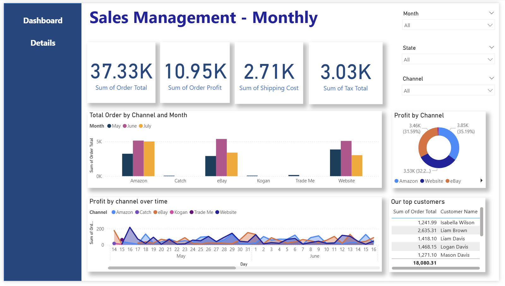
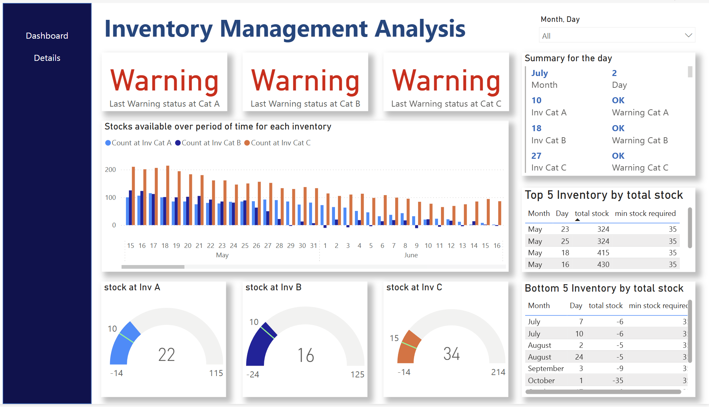

# Itikan BI Dashboards & Data Management Plan  

This repository documents two major projects completed for **Itikan**, an eCommerce company based in Australia:  

1. **Power BI Dashboards for Sales, Inventory, and Shipping Management**  
2. **Data Management Plan (DMP) for Marketing and Customer Data**  

Both projects respond to real-world business needs identified by the company’s leadership and demonstrate the application of **business intelligence** and **data governance** principles in practice.  

---

## Case Study 1: Power BI Dashboards  

### Background  
You were contacted by the CEO, **Jonathon Briggs**, who oversees all departments at Itikan with a focus on **sales, inventory, and distribution**.  

Jonathon’s challenge was that he received fragmented reports from different departments in inconsistent formats. He needed a single tool to:  
- View overall company performance at a glance  
- Drill down into details for **sales, profitability, shipping, and inventory**  
- Monitor key metrics like **monthly profit percentage**, **shipping efficiency**, and **stock availability**  

### Solution  
A set of **Power BI dashboards** was designed and implemented, following the **BI Dashboard Formula Methodology**:  
1. **Plan** – Defined a two-week timeline and deliverables  
2. **Scope** – Focused on sales, inventory, and shipment performance  
3. **Design** – Selected appropriate visuals (charts, gauges, filters) linked to business objectives  
4. **Develop & Test** – Built interactive dashboards with filtering, drill-downs, and validation  
5. **Launch** – Delivered final dashboards and reflected on development challenges and learning outcomes  

### Features  
- **Sales Dashboard**: Total sales by channel, monthly profit trends  
- **Inventory Dashboard**: Stock levels over time, gauge meters for critical thresholds  
- **Shipment Dashboard**: Costs by shipping method, average delivery times  

### Dashboard Screenshots  

#### Sales Management Dashboard  
  

#### Inventory Management Dashboard  
  

#### Shipment Management Dashboard  
  

### Outcome  
The dashboards provided Jonathon with a **single source of truth** for decision-making, enabling him to quickly assess performance and identify areas requiring action.  
 

---

## Case Study 2: Data Management Plan (DMP)  

### Background  
Following the success of the dashboards, the CEO requested a broader **Data Management Plan** (DMP) to ensure proper handling of sensitive data.  

The concern was that while marketing and customer data was increasingly used for campaigns (email, social media, events, workshops), the company lacked a formal framework for:  
- **Internal data usage**  
- **Sharing data externally with agencies**  
- **Protecting sensitive customer information** (RFM metrics, purchase history, personal details)  

### Solution  
A **Data Management Plan** was created for all eCommerce data at Itikan. The plan covers:  
- **Data Collection** – Processes for gathering consistent, accurate, and relevant data  
- **Metadata** – Standards for documenting datasets for usability and reproducibility  
- **Ethics & Legal Compliance** – Ensuring adherence to privacy regulations and ethical handling of customer data  
- **Storage & Backup** – Secure storage solutions, redundancy, and backup schedules  
- **Preservation** – Long-term strategies for maintaining data accessibility  
- **Data Sharing** – Controlled mechanisms for internal and external stakeholders  
- **Data Governance** – Policies for ownership, responsibility, and accountability  

The DMP ensures that customer data is handled responsibly, reducing the risk of **brand damage** or **financial loss** from misuse or breaches.  

---

## Repository Contents  

- `docs/` → Business Report and Data Management Plan documentation  
- `dashboards/` → Power BI files (Sales, Inventory, Shipment dashboards)  
- `assets/` → Dashboard screenshots for quick reference  
- `CASE_STUDY.md` (optional) → Extended version of the case study for detailed context  

---

## Conclusion  

This repository showcases both the **practical BI solution** (Power BI dashboards) and the **strategic data governance framework** (DMP). Together, they demonstrate how eCommerce companies like Itikan can:  
- Gain insights through interactive dashboards  
- Manage sensitive data responsibly for sustainable growth  

---
